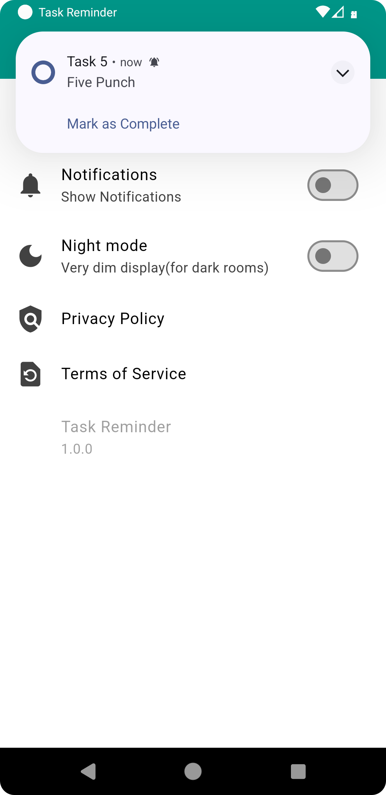
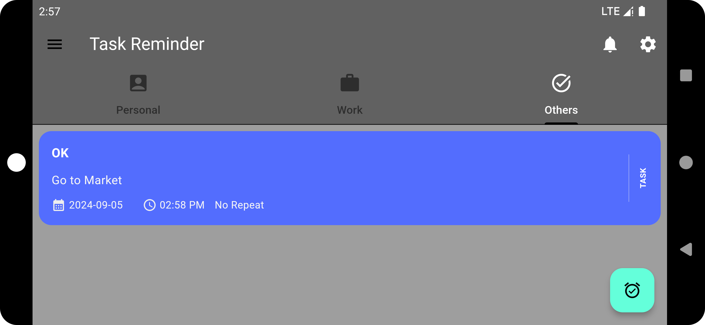

# ✅Task Reminder Application

- Welcome to the Task Reminder Application! This Flutter app helps you keep track of your tasks with custom reminders.  
- You can organize your tasks into three categories: Work, Personal, and Others.  
- The app supports timely special reminders (e.g., 1 minute, 10 minutes, or 1 hour) and also features a dark mode option.

## Features

- **Custom Reminders:** Set reminders with a title, content, date, and time.
- **Categorization:** Organize reminders into three categories - Work, Personal, and Others.
- **Timely Special Reminders:** Choose from pre-defined reminder times such as 1 minute, 10 minutes, or 1 hour.
- **Dark Mode:** Switch between light and dark modes for a personalized experience.
- **Push Notifications:** Receive push notifications for your reminders.

## Getting Started

To get started with the Task Reminder Application, follow the instructions below.

### Prerequisites

- Flutter 3.0.0 or later
- Dart 2.18.0 or later
- An IDE such as Visual Studio Code or Android Studio

### Installation

1. **Clone the repository:**

   ```bash
   git clone https://github.com/vinit105/DE_Project.git  


### Project Structure
lib/  
├── model/   
│ ├── [tasks.dart](./lib/model/tasks.dart)  
├── notification_services/   
│ ├── [local_notification_service.dart](./lib/notification_services/local_notification_service.dart)  
│ ├── [notification_details.dart](./lib/notification_services/notification_details.dart)  
├── provider/  
│ ├── [task_provider.dart](./lib/provider/task_provider.dart)  
│ ├── [theme_provider.dart](./lib/provider/theme_provider.dart)  
├── screens/  
│ ├── [add_task.dart](./lib/screens/add_task.dart)  
│ ├── [homepage.dart](./lib/screens/homepage.dart)  
│ ├── [notification_screen.dart](./lib/screens/notification_screen.dart)  
│ ├── [profile_page.dart](./lib/screens/profile_page.dart)  
│ ├── [reminders_screen.dart](./lib/screens/reminders_screen.dart)  
│ ├── [setting_page.dart](./lib/screens/setting_page.dart)  
├── services/  
│ ├── [database_services.dart](./lib/services/database_services.dart)  
├── theme/  
│ ├── [dark_theme.dart](./lib/theme/dark_theme.dart)  
│ └── [light_theme.dart](./lib/theme/light_theme.dart)    
├── ui/  
│ ├── [input_fields.dart](./lib/ui/input_fields.dart)  
└── [main.dart](./lib/main.dart)  

## Contributing
Contributions are welcome! To contribute:

- Fork the repository.
- Create a new branch (git checkout -b feature/YourFeature).
- Make your changes.
- Commit your changes (git commit -am 'Add some feature').
- Push to the branch (git push origin feature/YourFeature).
- Create a Pull Request.

For help getting started with Flutter development, view the
[online documentation](https://docs.flutter.dev/), which offers tutorials,
samples, guidance on mobile development, and a full API reference.


## Screenshots

<div>




</div>
<hr/>
<div>




</div>


<hr>
## Demo Video  

[](https://github.com/user-attachments/assets/774d156d-6032-48a8-a020-bf24482e29bb)
